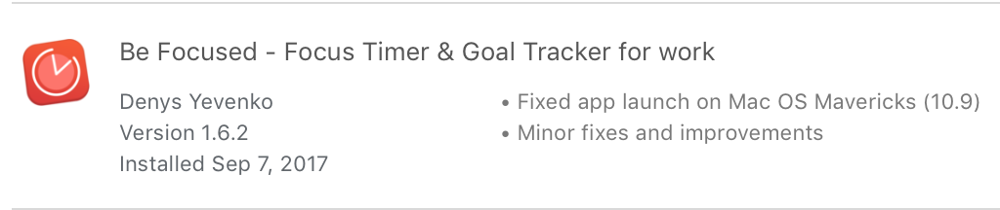
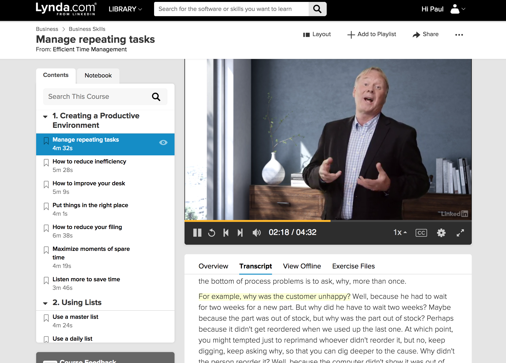
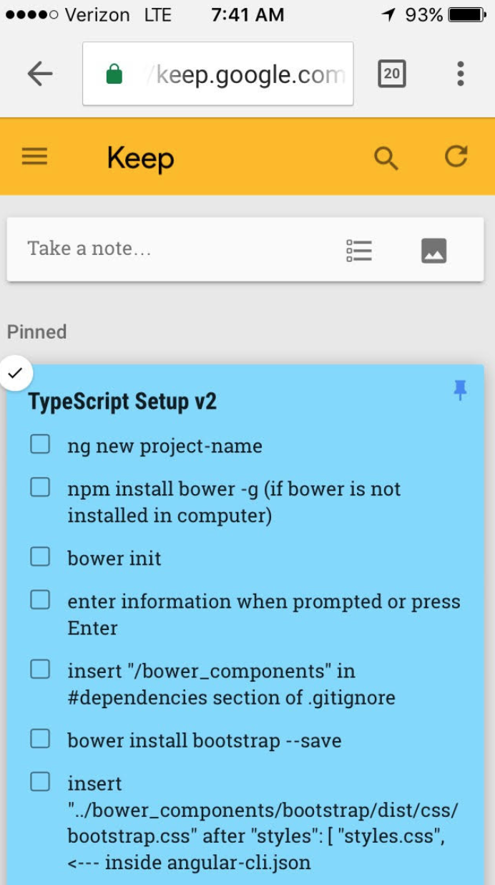
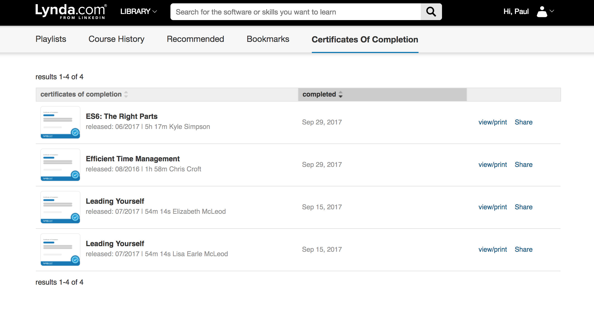
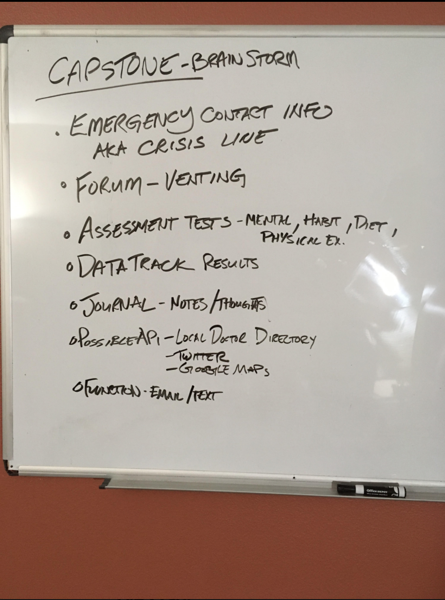

#_self-assessment_
##_by Paul Guevarra_
##_Background_
_I had never thought I would become a software developer. However, I was fascinated with how people are able to create websites, applications, and other programs that users are utilizing on a daily basis._
_I was intrigued with the "how" of things. How did it know to do that? How come it looks like this? How does this work?_
_I began teaching myself how to code through online tutorials and reading literature. I enjoyed discovering all these bits of information and learning how to communicate with computers so much that I decided to enroll into Epicodus._
_During my first block, I learned HTML, CSS, and some JavaScript. I was a bit self-conscious with the level of my skills. But, I pushed on through. Like a sponge, I absorbed as much as I could and created some amazing things._
_When the next block, Java, came, I found myself all over the place. I struggled with completing projects. I found myself fixated on a problem and unable to move forward. I became overwhelmed to a point of not being able to sleep multiple nights. Yet, I still found it fascinating. I got lots of practice learning how to debug. I discovered my skills to be able to read code, develop methods, and fix problems. I found myself in an odd situation of I knowing I could do things, yet placing myself in bad positions._
_Before entering the next block, JavaScript, I decided to conduct a self-assessment and develop a plan to lessen the possibility of the negative experiences from the previous block._

##_Problematic Issues_
* _Time management: Projects are not submitted on time._
* _Self (wellness) management: Unable to manage stress effectively._

##_Plan_
###_Time management_
* _Pomodoro Clock/Timers: Utilize a timer to be able to set time increments to stay on task and distinguish between time allotted for work and time allotted for breaks._

* _Discover tips: Find new ways to help with time management._

* _Structure: Utilize checklists._

* _Use outside resources: Understanding the course material was problematic for me as it heavily utilized text. I have to find ways to learn the same material in different forms (i.g. videos, graphics, and audio)._

* _Utilize Dry Boards: Use dry boards to visualize ideas and pathways for projects._

###_Self management/wellness_
* _Support group: Seek people who can help. Find people I can confide in._
* _Sleep & Exercise: Stress can negatively affect a persons production. Getting enough sleep and exercise are good ways for stress relief. Doing meditation exercises help calm the mind to re-focus._

##_Follow-up_
_The end of the JavaScript block is here. More structure in my life certainly helped. Creating step lists with Google Keep helped me stay on track when creating a project. The pomodoro clock helped allot my time. However, I still have a tendency to inefficiently use my time correctly. That is a behavior I would need to continually work on. I found that using outside sources helped me understand the material more thus not having the feeling of falling behind._
_Connecting and opening to friends in the field helped keep me grounded. It is very encouraging and I feel less intimidated to ask for help._

###_What got accomplished today_
_I was able to complete:_
* _5 course hours of ES6._
* _2 course hours of effective time management._
